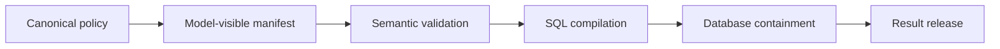

# PolicyStrata

<!-- project-record: policystrata -->

**Active open-source project · MIT License**

PolicyStrata finds policy drift between the layers of SQL and governed-data agents.
It is for teams whose model-visible tools, validators, compilers, database controls,
and result-release gates can each pass alone while disagreeing as a system.

[Python package](https://pypi.org/project/policystrata/) ·
[Node package](https://www.npmjs.com/package/policystrata) ·
[Documentation](docs/) ·
[Paper and narrated overview](https://raintree.technology/writing/policystrata)

## See a failure

```bash
uvx policystrata demo --out runs/demo
```

No manual install or LLM API key is required. The deterministic demo writes JSONL
traces, a summary, and minimized witnesses. One worked result looks like this:

```text
Request: Show escalations by severity for my tenant.
Version vector: manifest=v7 … compiler=v5 … release=v7
First violated transition: compiler (lowering_violation)
Why: compiler used legacy_tenant_id instead of tenant_id
Containment: database
Release: blocked
```



PolicyStrata reports the first transition that broke its declared responsibility,
while preserving evidence that a later layer contained the failure.

## Why use PolicyStrata

- **Catch disagreement, not only local defects.** Test the handoffs between controls
  that ordinary unit tests inspect separately.
- **Get a small witness.** Minimized output identifies the version vector, first
  violated responsibility, distinguishing result, containment, and release decision.
- **Run deterministic CI.** Generated and imported traces do not require a model call.
- **Adopt by surface.** Start with offline scanning, then choose whether the in-process
  runtime or self-hosted gateway belongs on the request path.

## Is it for you?

The strongest supported path is SQL and data-agent policy drift: text-to-SQL systems,
BI copilots, semantic models, PostgreSQL row-level security, and governed analytics.

Use it when policy vocabulary is repeated across manifests, validation, SQL lowering,
database containment, or release filters and you can export sanitized traces. It is
not a model-quality benchmark, penetration-testing suite, or replacement for runtime
authorization.

## Scan an application

```bash
uvx policystrata init-scan --out policystrata
uvx policystrata scan \
  --config policystrata/policystrata.yaml \
  --out runs/policystrata
uvx policystrata doctor --config policystrata/policystrata.yaml
```

`scan` finds drift in configured artifacts and exported traces. `doctor` reports
missing stack surfaces and release gates. Add `--strict` only after every remaining
readiness gap should block CI.

| Surface | Install | Role |
| --- | --- | --- |
| Python CLI and scanner | `python -m pip install policystrata` | Offline scans, benchmarks, and CI gates |
| Node recorder and runtime | `npm install policystrata` | Sanitized trace capture and in-process decisions |
| Self-hosted gateway | `npm install @policystrata/agent-trust-gateway` | Out-of-process enforcement and decision envelopes |
| GitHub Action | Pin a released `v*` tag | Pull-request scanning and SARIF |

## Evidence and limits

In PolicyStrata’s published operator taxonomy, responsibility-scoped contracts caught
all 1,720 injected faults. A layered point-control comparison missed 159 of those
cases. This is an internal fault-model consistency result, not production recall.

The result shows reproducible coverage of declared mutations and localization of the
first failed handoff. It does not show recall on unknown field failures or independent
deployment effectiveness. Read the [evidence snapshot](docs/evidence.md),
[failure taxonomy](docs/failure-taxonomy.md), and
[paper](https://raintree.technology/writing/policystrata/PolicyStrata.pdf) before using
the result in a public claim.

The scanner is a regression tester and release gate, not an authorization boundary.
Keep application authorization and database controls in the system being tested.

## Data-safety boundary

- Keep prompts, documents, rows, tool payloads, credentials, and private schemas local.
- Export only the metadata required for a finding or release decision.
- Treat generated-case coverage as fault-model coverage, not field recall.
- Treat scanner findings as regression evidence, not proof of authorization correctness.

The gateway strips event payloads and fixture-only expectations from uploads by
default and rejects common sensitive-data and secret patterns before sending metadata.

## Documentation

- [Scanner](docs/scanner.md) — Configuration, traces, findings, and gates.
- [Testing an AI data assistant](docs/testing-ai-data-assistant.md) — First adoption workflow.
- [Runtime controls](docs/runtime-controls.md) — In-process decisions and rollout modes.
- [Trace contract](docs/trace-contract.md) — Schema and redaction.
- [Distribution](docs/distribution.md) — Packages and compatibility.
- [Brownfield studies](docs/brownfield-results.md) — Scope, provenance, and findings.
- [Paper build](docs/paper-build.md) — Editable paper source and reproduction.

## Raintree open-source system

PolicyStrata owns cross-layer policy regression testing. It can be used independently.
[DocPull](https://github.com/raintree-technology/docpull) acquires evidence,
[HIG Doctor](https://github.com/raintree-technology/hig-doctor) audits interfaces,
[Trellis](https://github.com/raintree-technology/trellis) enforces shared code policy,
and [Raintree Standards](https://github.com/raintree-technology/raintree.standards)
defines governed requirements. See the
[Raintree open-source portfolio](https://raintree.technology/portfolio#open-source).

## Project policies

[Contributing](CONTRIBUTING.md) · [Code of Conduct](CODE_OF_CONDUCT.md) ·
[Security](SECURITY.md) · [Changelog](CHANGELOG.md) ·
[Source repository](https://github.com/raintree-technology/policystrata) · [MIT License](LICENSE)
