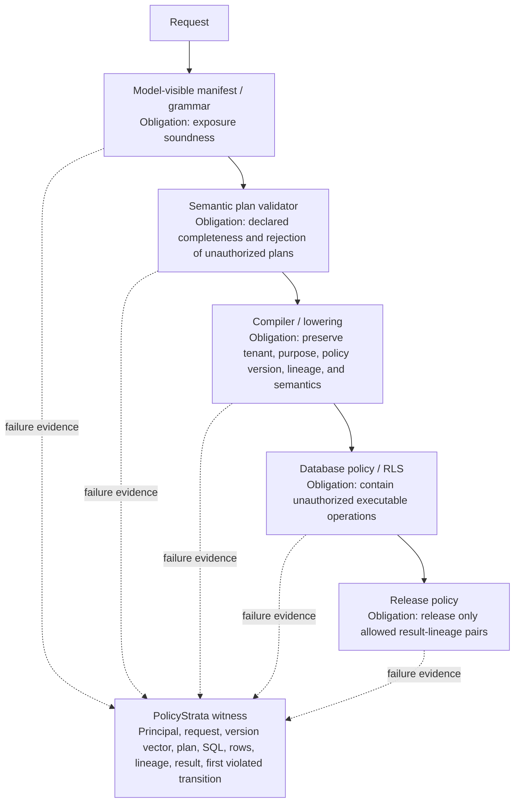

# Pipeline Diagram

Use this as the source for the main paper, poster, or talk diagram.

```mermaid
flowchart TD
  A["Request"]
  B["Model-visible manifest / grammar<br/>Obligation: exposure soundness"]
  C["Semantic plan validator<br/>Obligation: declared completeness and rejection of unauthorized plans"]
  D["Compiler / lowering<br/>Obligation: preserve tenant, purpose, policy version, lineage, and semantics"]
  E["Database policy / RLS<br/>Obligation: contain unauthorized executable operations"]
  F["Release policy<br/>Obligation: release only allowed result-lineage pairs"]
  G["PolicyStrata witness<br/>Principal, request, version vector, plan, SQL, rows, lineage, result, first violated transition"]

  A --> B --> C --> D --> E --> F
  B -. failure evidence .-> G
  C -. failure evidence .-> G
  D -. failure evidence .-> G
  E -. failure evidence .-> G
  F -. failure evidence .-> G
```

